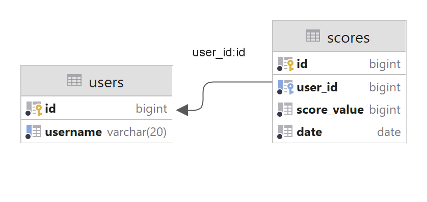

## Краткое описание
Данная работа является частью группового проекта по практическому курсу ТРКПО ИКНТ ВШПИ СПбПУ.

## Схема БД


## API
- `GET /scores/top/{n}` возвращает топ `n` рейтингов игроков. С помощью параметра `username` можно произвести выборку рейтингов конкретного игрока;
- `POST /scores` публикует новый рейтинг, принимая в качестве тела DTO следующего вида:
  ```json
  {
    "username": "CallMeNeva",
    "value": 1000000
  }
    ```
  В случае отсутствия игрока с заданным юзернеймом на месте создаётся новый.

## Сборка и запуск
Для сборки проекта требуется установленный JDK 17-й версии с настроенным `JAVA_HOME`. Как только это требование удовлетворено, достаточно запустить
обёртку Maven следующим образом:
```shell
./mvnw package
```
или
```shell
mvnw.cmd package
```
если сборка происходит на Microsoft Windows. По окончанию сборки в директории `target/` будет лежать исполняемый `jar`. При запуске приложения
требуется указать логин и пароль БД, что можно сделать с помощью параметров CLI `--db-username` и `--db-password` следующим образом:
```shell
--db-username=admin --db-password=admin
```
Аналогично можно указать хост и порт подключения к БД с помощью `--db-host` и `--db-port`, которым по умолчанию присвоены значения `localhost` и
`3306` соответственно.

В случае надобности было бы также неплохо сначала проинициализировать БД с помощью `db/init_db.sql`.
